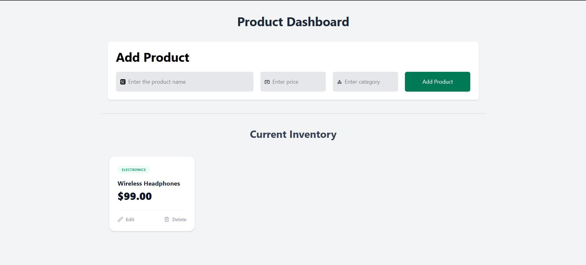

# API Hunter

API Hunter is a robust React application designed to help developers test, manage, and hunt down API endpoints efficiently. Built with a modern tech stack for speed and usability.


## 📸 UI Screenshot



## ✨ Features

- **Fast & Responsive**: Powered by Vite for lightning-fast HMR and builds.
- **Modern Design**: Styled with Tailwind CSS for a sleek, responsive look.
- **Interactive UI**: Includes custom components like confirmation toasts and modal interactions.
- **Developer Friendly**: Clean code structure and easy to extend.

## 🛠️ Tech Stack

- React
- Vite
- Tailwind CSS
- React Icons

## 🚀 Getting Started

### Prerequisites

Ensure you have Node.js installed on your machine.

### Installation

1.  **Clone the repository**

    ```bash
    git clone https://github.com/MokshPShah/React-Js
    ```

2.  **Install dependencies**

    ```bash
    npm install
    ```

3.  **Run the development server**
    ```bash
    npm run dev
    ```

## 🤝 Contributing

Contributions are welcome! Please follow these steps:

1.  Fork the project.
2.  Create your feature branch (`git checkout -b feature/AmazingFeature`).
3.  Commit your changes (`git commit -m 'Add some AmazingFeature'`).
4.  Push to the branch (`git push origin feature/AmazingFeature`).
5.  Open a Pull Request.

## 📝 License

This project is licensed under the MIT License.
