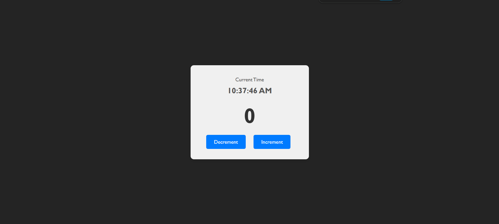

# Counter App

A simple and interactive Counter application built using React JS. This project demonstrates basic state management in React components, event handling, and functional component structure.

## Screenshot



## Features

- **Increment**: Increase the counter value by 1.
- **Decrement**: Decrease the counter value by 1.
- **Reset**: Reset the counter back to zero instantly.
- **Responsive Design**: Works on desktop and mobile devices.

## Technologies Used

- **React JS**: A JavaScript library for building user interfaces.
- **CSS**: For styling the application components.
- **Node.js & npm**: For package management and running the development server.

## Getting Started

Follow these instructions to get a copy of the project up and running on your local machine.

### Prerequisites

Make sure you have Node.js and npm installed on your machine. You can download them from [nodejs.org](https://nodejs.org/).

### Installation

1.  **Clone the repository:**
    ```bash
    git clone https://github.com/MokshPShah/React-Js.git
    cd Counter
    ```

2.  **Install dependencies:**
    Navigate to the project directory and run:
    ```bash
    npm install
    ```

3.  **Run the application:**
    Start the development server:
    ```bash
    npm start
    ```
    The app will open in your browser at `http://localhost:5173`.

## Project Structure

```
Counter/
├── node_modules/
├── public/
│   ├── index.html
│   └── ...
├── src/
│   ├── App.css
│   ├── App.js
│   ├── index.js
│   └── ...
├── package.json
└── README.md
```

## Contributing

Contributions are welcome! Please feel free to submit a Pull Request.

## License

This project is open source and available under the MIT License.