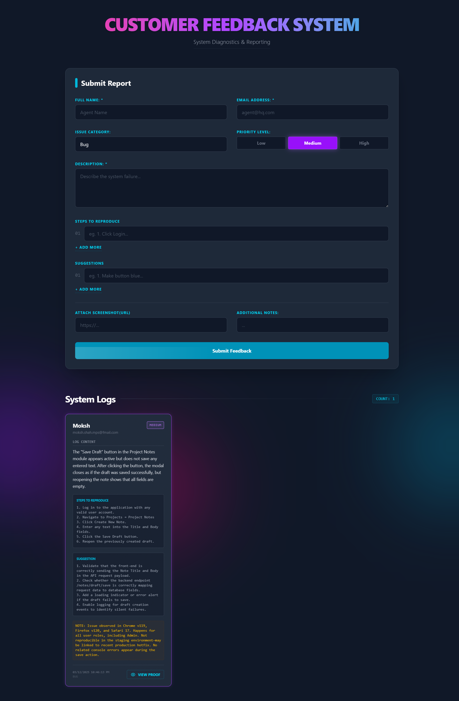

# Customer Feedback System

A sleek and modern single-page application built with React and Tailwind CSS for collecting and displaying system diagnostics and user feedback. It features a dynamic form for detailed report submission and a real-time updated list of feedback entries, all wrapped in a futuristic, cyberpunk-inspired user interface.

## Screenshot

Below are some screenshots showcasing the application's features and design.

#### Main Dashboard
*The main view of the application, showing the feedback form and the system logs.*



---

## ✨ Features

-   **Dynamic Feedback Form:** Submit detailed reports with fields for name, email, category, priority, description, and more.
-   **Dynamic Lists:** Easily add or remove multiple "Steps to Reproduce" and "Suggestions" for comprehensive reports.
-   **Priority-Based Styling:** Feedback cards are color-coded (High, Medium, Low) for quick visual identification of urgency.
-   **Real-time Feedback Display:** Submitted feedback instantly appears in the "System Logs" section without a page refresh.
-   **Responsive Design:** A clean and functional layout that works seamlessly across desktop, tablet, and mobile screen sizes.
-   **Modern UI/UX:** Features a glassmorphism design, smooth animations, and gradient effects for an engaging and visually appealing user experience.
-   **Client-Side Validation:** Ensures required fields like name, email, and description are filled correctly before submission.

---

## 🛠️ Tech Stack

-   **Frontend:**
    -   [React.js](https://reactjs.org/)
    -   [Tailwind CSS](https://tailwindcss.com/)
-   **Build Tool:**
    -   [Vite](https://vitejs.dev/)

---

## 🚀 Getting Started

Follow these instructions to get a copy of the project up and running on your local machine for development and testing purposes.

### Prerequisites

Make sure you have [Node.js](https://nodejs.org/) and [npm](https://www.npmjs.com/) installed on your machine.

### Installation

1.  Clone the repository to your local machine:
    ```sh
    git clone https://github.com/MokshPShah/React-Js.git
    ```
2.  Navigate into the project directory:
    ```sh
    cd Customer-Feedback
    ```
3.  Install the necessary dependencies:
    ```sh
    npm install
    ```
4.  Start the development server:
    ```sh
    npm run dev
    ```
5.  Open your browser and visit `http://localhost:5173` (or the address shown in your terminal) to see the application live.