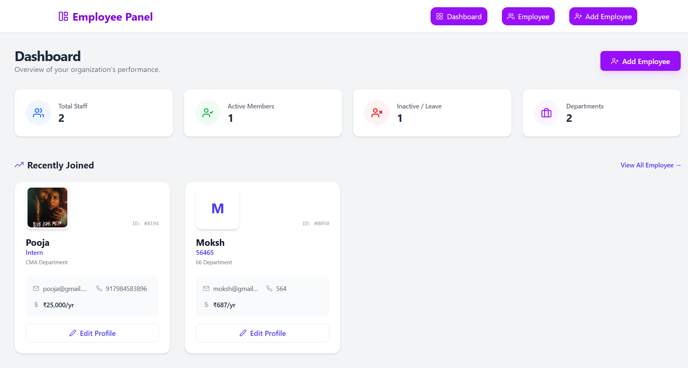
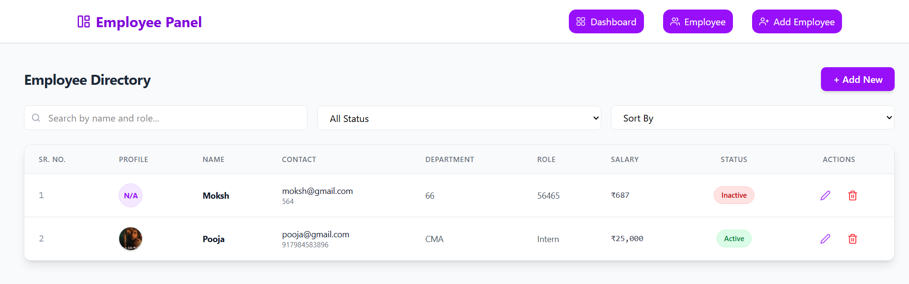
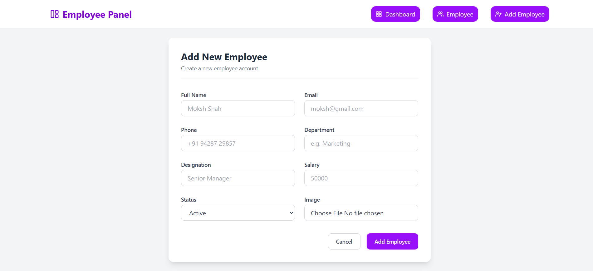

# Employee Management System

A modern, responsive React application designed to streamline the process of managing employee records. Built with efficiency and user experience in mind, this project leverages the power of Vite for fast build times and Tailwind CSS for a sleek, mobile-friendly interface.

This application serves as a comprehensive demonstration of CRUD (Create, Read, Update, Delete) operations in a client-side environment, utilizing browser LocalStorage for data persistence. It is an ideal reference for developers looking to understand state management, routing, and form handling in React.

## 🚀 Features

The Employee Management System comes packed with features to handle employee data effectively:

-   **Comprehensive Employee Management**:
    -   **Add Employee**: A detailed form allows you to input essential information such as Full Name, Email, Phone Number, Department, Designation, Salary, and Employment Status.
    -   **View Employees**: A clean dashboard view to list all employees with their key details.
    -   **Edit & Update**: Capability to modify existing employee records seamlessly.
    -   **Delete**: Remove employee records from the system with ease.

-   **Rich Media Support**:
    -   **Image Upload**: Users can upload profile pictures for employees.
    -   **Validation**: Built-in checks ensure images do not exceed 2MB, optimizing performance and storage.

-   **Robust Data Persistence**:
    -   **LocalStorage Integration**: All data is saved directly to the user's browser LocalStorage. This means your data survives page reloads and browser restarts without needing a backend server for this demo.

-   **Modern User Interface**:
    -   **Responsive Design**: Fully responsive layout ensuring usability across Desktops, Tablets, and Mobile devices.
    -   **Tailwind CSS**: Utilizes utility-first CSS for consistent and maintainable styling.

-   **Seamless Navigation**:
    -   **Client-Side Routing**: Powered by `react-router-dom` for smooth transitions between the Dashboard, Add Employee, and Details views without full page reloads.

## 🛠️ Tech Stack

This project is built using a robust modern web development stack:

-   **Frontend Library**: React (v18+) - The library for web and native user interfaces.
-   **Build Tool**: Vite - Next Generation Frontend Tooling for lightning-fast HMR and builds.
-   **Styling**: Tailwind CSS - A utility-first CSS framework for rapid UI development.
-   **Routing**: React Router DOM - The standard routing library for React.
-   **State Management**: React `useState` and `useEffect` hooks for managing local state and side effects.

## 📂 Project Structure

Here's a quick look at the top-level file structure to help you navigate the codebase:

```text
Data Table/
├── public/
│   └── screenshots/      # Images used in README
├── src/
│   ├── pages/            # Page components (AddEmployee, Dashboard, etc.)
│   ├── App.jsx           # Main application component with Routes
│   ├── main.jsx          # Entry point
│   └── index.css         # Tailwind directives and global styles
├── index.html            # HTML template
├── package.json          # Project dependencies and scripts
├── tailwind.config.js    # Tailwind configuration
└── vite.config.js        # Vite configuration
```

## 📸 Screenshots

Take a tour of the application interface:

### Dashboard / List View
The main hub where you can see all employees at a glance.


### Employee Details
View specific details about an employee.


### Add Employee Form
An intuitive form with validation to onboard new staff.


## 💻 Getting Started

Follow these instructions to get a copy of the project up and running on your local machine for development and testing purposes.

### Prerequisites

Before you begin, ensure you have the following installed:
-   **Node.js** (v14.0.0 or higher)
-   **npm** (usually comes with Node.js)

### Installation

1.  **Clone the repository** (if applicable) or download the source code.

2.  **Navigate to the project directory**:
    ```bash
    cd "Data Table"
    ```

3.  **Install dependencies**:
    This will install React, Vite, Tailwind, and other necessary packages.
    ```bash
    npm install
    ```

### Running the Application

1.  **Start the development server**:
    ```bash
    npm run dev
    ```
    Open your browser and visit `http://localhost:5173` (or the port shown in your terminal).

2.  **Build for production**:
    To create an optimized build for deployment:
    ```bash
    npm run build
    ```

3.  **Preview production build**:
    ```bash
    npm run preview
    ```

## 🤝 Contributing

Contributions are what make the open-source community such an amazing place to learn, inspire, and create. Any contributions you make are **greatly appreciated**.

1.  Fork the Project
2.  Create your Feature Branch (`git checkout -b feature/AmazingFeature`)
3.  Commit your Changes (`git commit -m 'Add some AmazingFeature'`)
4.  Push to the Branch (`git push origin feature/AmazingFeature`)
5.  Open a Pull Request

## 🔮 Future Improvements

-   **Backend Integration**: Connect to a Node.js/Express backend with MongoDB for permanent storage.
-   **Authentication**: Add Login/Signup functionality for secure access.
-   **Dark Mode**: Implement a toggle for Dark/Light theme using Tailwind.
-   **Export Data**: Allow exporting employee data to CSV or PDF.

## 👤 Author

**Moksh Shah**

-   Developer and Maintainer of this project.
-   Passionate about React and modern web technologies.

Feel free to reach out if you have any questions or suggestions regarding this project!

## 📄 License

This project is licensed under the MIT License - see the LICENSE file for details.
