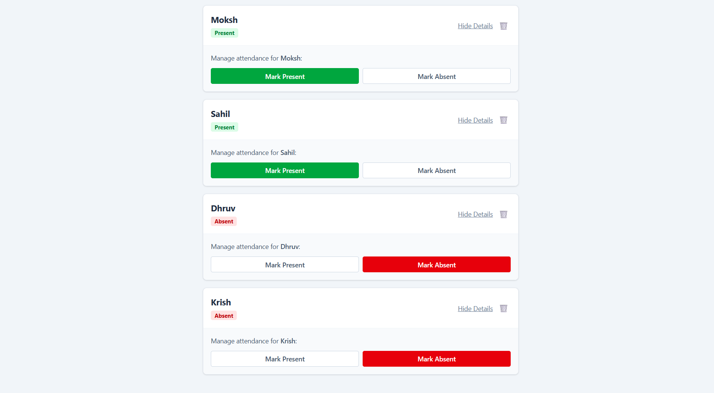
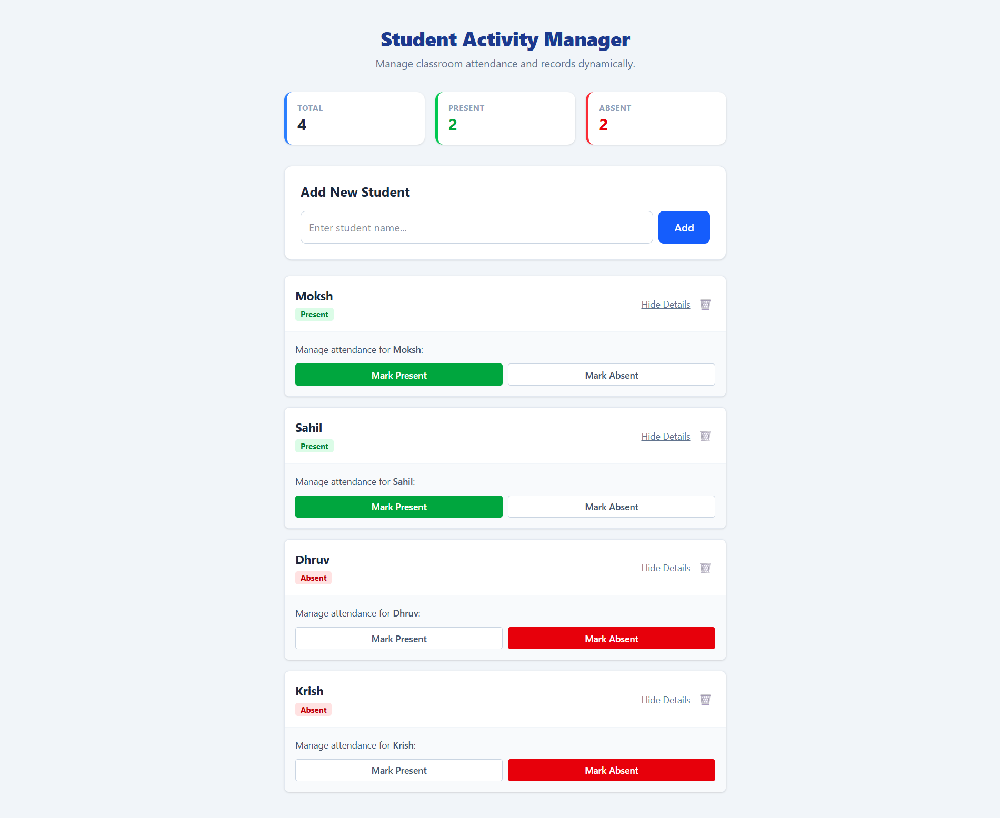

# Event Handler Project

A simple React project that handles adding and displaying students using multiple components. The app shows how data moves between components, how forms work, and how lists are displayed in React.

---

## 1. App.jsx
This is the main component that controls the entire app. It stores the list of students, handles adding new ones, and passes data to other components to display. All major state changes happen here.

---

## 2. StudentForm.jsx
A form where the user enters a student's name and age. It handles input changes and submits the data back to App.jsx. This component focuses only on collecting user input.

---

## 3. StudentList.jsx
This component receives the full student list and displays each student using the StudentCard component. It loops through the data and makes sure all students are shown properly.

---

## 4. StudentCard.jsx
Shows one student’s details in a simple card style. It receives the student’s name and age as props and displays them. This component is just for presentation.

**Screenshot:**  

---

## Full Project Screenshot

---

## 👤 Author

**Moksh Shah**  
Built with ❤️, React, and endless curiosity.

---

> ⭐ If you like this project, consider giving it a star on GitHub!