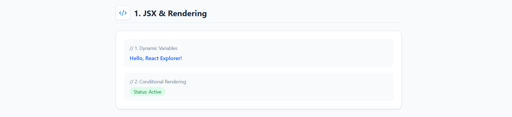
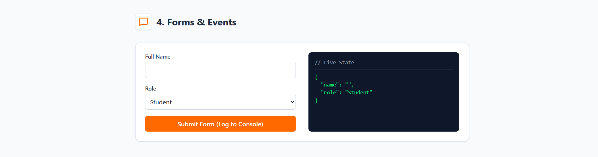
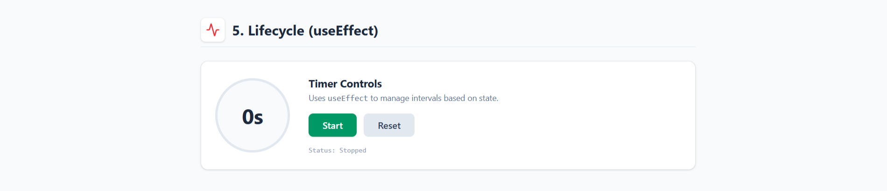
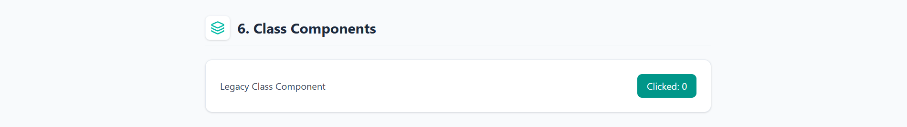

# Explorer Project

## Project Definition
A small React learning project containing separate modules for JSX, Props, State, Lists, Forms, and Lifecycle concepts. Each module is created to help beginners clearly understand how React components work and how data flows, updates, and renders inside a real project environment.

---

## Modules

---

### 1. JSX
JSX shows how React mixes JavaScript and HTML-like syntax to create dynamic UI. This module demonstrates variables inside UI, expressions, and returning elements from functions. It helps beginners understand how React actually renders components and how the browser interprets JSX through the build process.

**Screenshot:**  

---

### 2. Props  
Props show how data moves from parent to child components. This module demonstrates reusable components, custom messages, passing values, and accessing them inside the child. Understanding props helps build flexible UI that can display different information without rewriting the component every time.

**Screenshot:**  

---

### 3. Lists  
The Lists module demonstrates rendering arrays using `.map()`, assigning keys, and dynamically generating UI elements. Using lists is essential for showing collections like menus, categories, notifications, or products. This module explains best practices that keep your React app predictable and efficient when managing repeated UI blocks.

**Screenshot:**  

---

### 4. Forms  
This module covers controlled inputs, handling user events, and managing form data using state. It shows how React processes keystrokes, stores input values, and updates UI instantly. Forms are a must-have for login pages, search bars, filters, and data entry, making this module extremely practical.

**Screenshot:**  

---

### 5. Lifecycle  
The Lifecycle module uses `useEffect` to demonstrate mounting, updating, and cleanup phases. It explains how to run code when a component loads, when inputs change, or when it leaves the screen. This is important for API calls, timers, listeners, and syncing UI with external systems.

**Screenshot:**  

---

### 6. Class Component  
This module demonstrates a full class-based React component with constructor initialization, state handling using `this.state`, updates through `this.setState()`, and lifecycle logging using `componentDidMount` and `componentDidUpdate`. It also includes an interactive button that increments a counter, helping learners understand event handling in class components.

**Screenshot:**  

---

## Full Project Screenshot

---

## 👤 Author

**Moksh Shah**  
Built with ❤️, React, and endless curiosity.

---

> ⭐ If you like this project, consider giving it a star on GitHub!