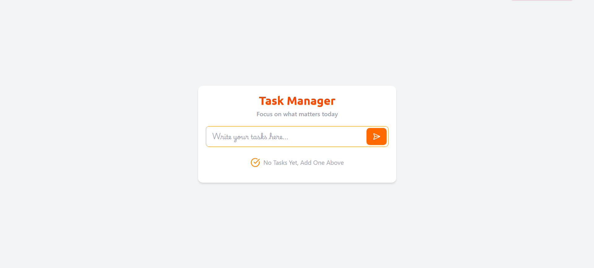
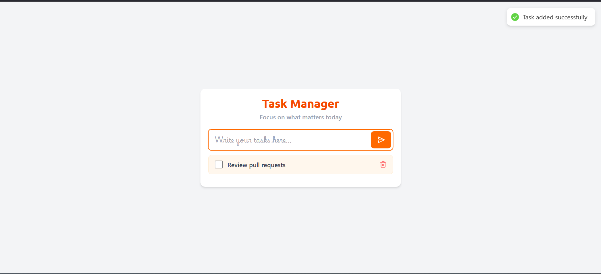
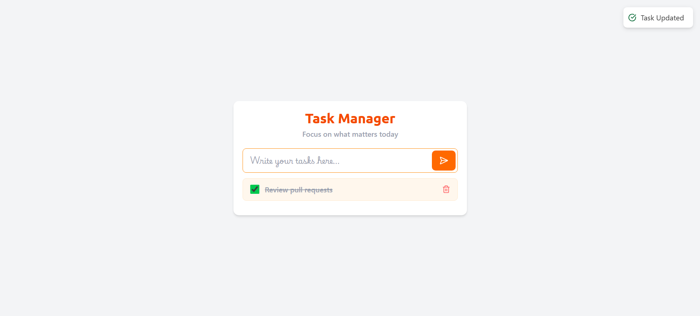
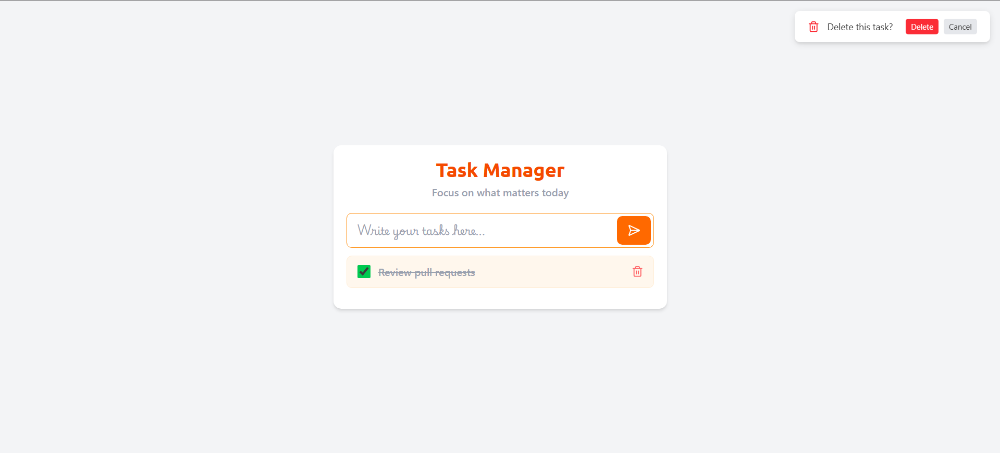
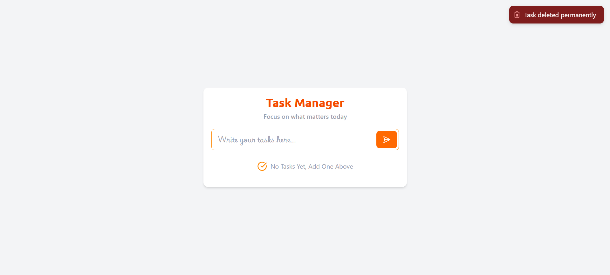

# React + Vite

# Task Manager Project

This template provides a minimal setup to get React working in Vite with HMR and some ESLint rules.
A comprehensive Task Manager application built with React JS. This project is designed to help users organize their daily tasks efficiently, offering features to add, edit, delete, and track the status of tasks.

Currently, two official plugins are available:

## 📋 Project Description

- [@vitejs/plugin-react](https://github.com/vitejs/vite-plugin-react/blob/main/packages/plugin-react) uses [Babel](https://babeljs.io/) (or [oxc](https://oxc.rs) when used in [rolldown-vite](https://vite.dev/guide/rolldown)) for Fast Refresh
- [@vitejs/plugin-react-swc](https://github.com/vitejs/vite-plugin-react/blob/main/packages/plugin-react-swc) uses [SWC](https://swc.rs/) for Fast Refresh
  The Task Manager is a React-based web application that provides a clean and intuitive interface for task management. It leverages React's state management hooks to handle data flow and ensures a responsive user experience.

## React Compiler

## ✨ Features

The React Compiler is not enabled on this template because of its impact on dev & build performances. To add it, see [this documentation](https://react.dev/learn/react-compiler/installation).

- **Add New Tasks**: Users can input task details to create new entries.
- **Edit Functionality**: Modify existing tasks to update information.
- **Delete Tasks**: Remove tasks that are completed or unnecessary.
- **Status Management**: Toggle tasks between completed and pending states.
- **Responsive UI**: Designed to work well on various screen sizes.

## Expanding the ESLint configuration

## 📸 Output

If you are developing a production application, we recommend using TypeScript with type-aware lint rules enabled. Check out the [TS template](https://github.com/vitejs/vite/tree/main/packages/create-vite/template-react-ts) for information on how to integrate TypeScript and [`typescript-eslint`](https://typescript-eslint.io) in your project.
Here are the output previews of the application:

### First Look ✨✨



### Add Task View



### Update Task View



### Delete Task Confirmation View



### Task Deleted View



## 🛠️ Tech Stack

- **React JS**: Core framework for building the component-based UI.
- **JavaScript (ES6)**: Used for application logic and functionality.
- **CSS / Tailwind**: Used for styling the application components.
- **Node.js & npm**: Used for package management and running the development environment.

## 🚀 Installation & Setup

Follow these steps to run the project locally:

1.  **Clone the repository:**

    ```bash
    https://github.com/MokshPShah/React-Js.git
    ```

2.  **Navigate to the project directory:**

    ```bash
    cd "Task Manager"
    ```

3.  **Install dependencies:**

    ```bash
    npm install
    ```

4.  **Start the application:**
    ```bash
    npm run dev
    ```
    The app will open in your browser at `http://localhost:5173`.

## Contributing

Feel free to explore, fork, and contribute to this repository.

```
 Happy Coding 😊😎
```

Made with ❤️ by **Moksh**.
