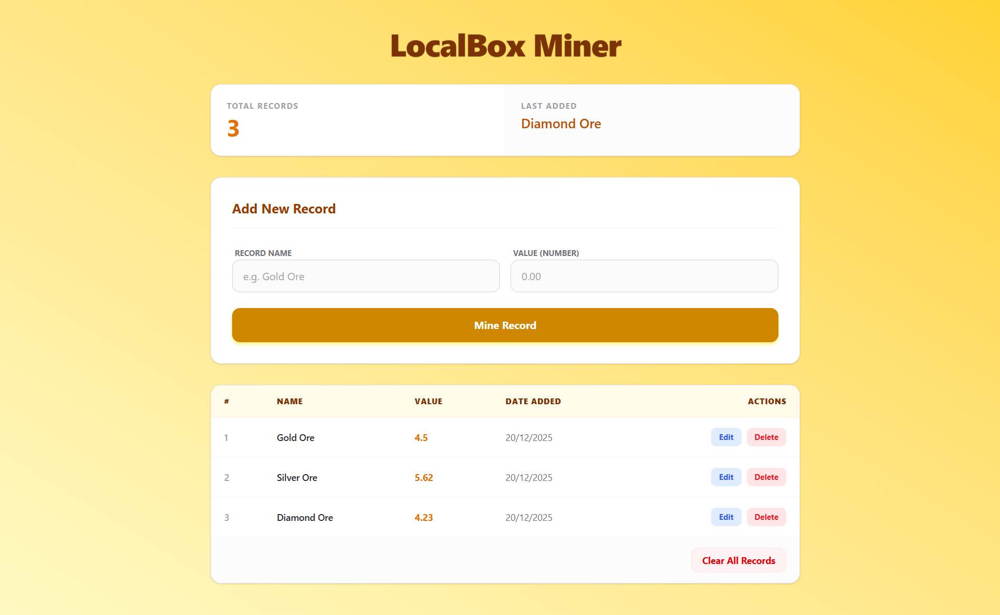
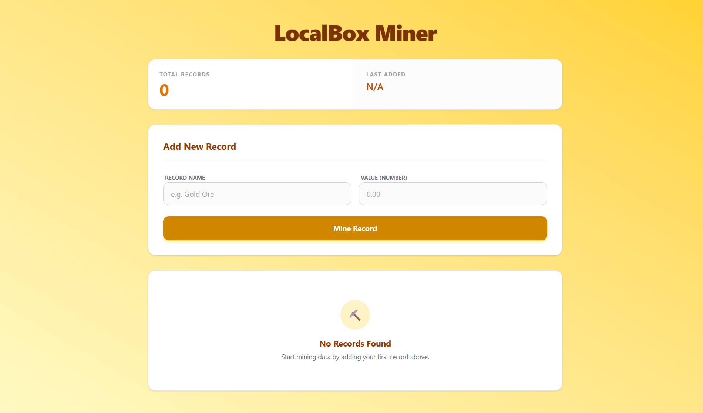

# LocalBox Miner

LocalBox Miner is a React application built with Vite designed to manage mining records. It features a user-friendly interface for tracking and validating mining data.

## Features

- **Dashboard**: View all mining records in a clean layout.
- **Add Records**: Form interface to input new data.
- **Validation**: Real-time error feedback for invalid inputs.

## Screenshots

### Full Page View


### Form Validation (Error State)


## Getting Started

### Prerequisites

- Node.js installed on your machine.

### Installation

1.  Clone the repository to your local machine:
    ```sh
    git clone https://github.com/MokshPShah/React-Js.git
    ```
2.  Navigate into the project directory:
    ```sh
    cd localbox_Miner
    ```
3.  Install the necessary dependencies:
    ```sh
    npm install
    ```
4.  Start the development server:
    ```sh
    npm run dev
    ```
5.  Open your browser and visit `http://localhost:5173` (or the address shown in your terminal) to see the application live.